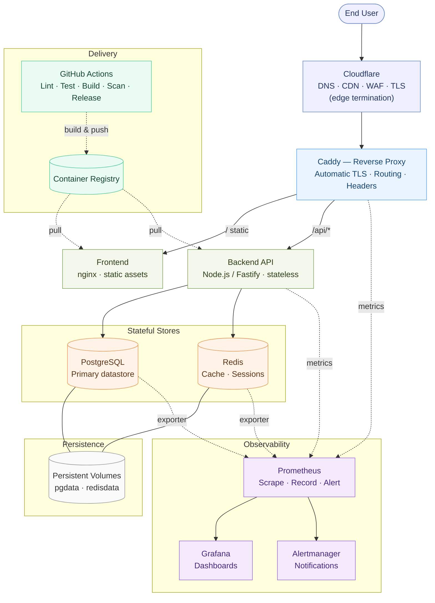
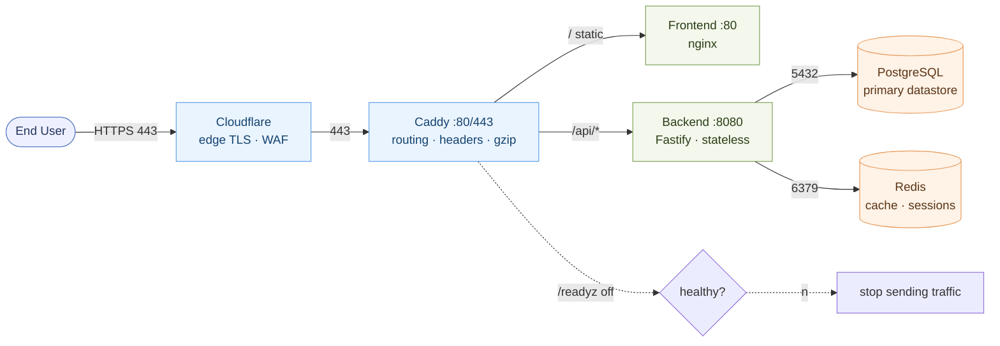
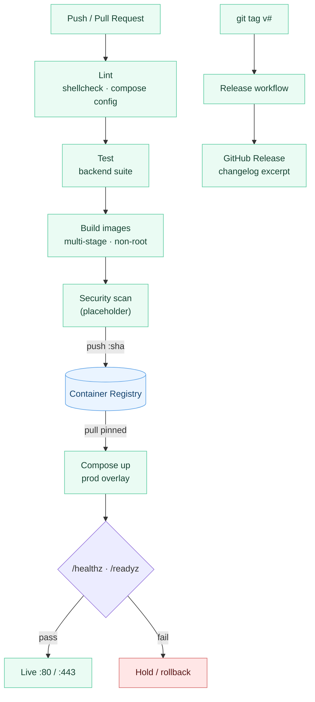
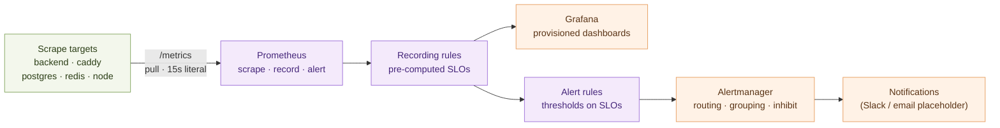
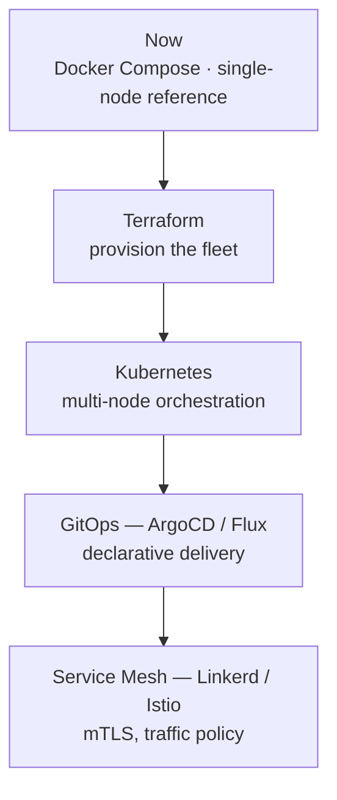

# Infrastructure Lab


> An opinionated reference architecture for hosting a modern SaaS application on a single host with Docker Compose — observable, secure by default, and documented as a blueprint you can copy, read, and grow from.

**Not a production deployment. Not a tutorial.** It is the kind of repository an experienced engineer publishes as a reusable starting point: minimal by intention, coherent by construction, and honest about its limits.

---

## TL;DR

- **What it is:** a reverse proxy → frontend → stateless backend → PostgreSQL + Redis stack, fully observable, designed to run on one host.
- **Stack:** Docker Compose · Caddy · nginx · Node.js (Fastify) · PostgreSQL · Redis · Prometheus · Grafana · GitHub Actions.
- **Read first:** [SYSTEM_DESIGN.md](SYSTEM_DESIGN.md) — the *why*. Then [docs/](docs/) — the *how*.
- **Run it:**
  ```bash
  cp .env.example .env
  make bootstrap   # generates secrets, preflight checks
  make up          # bring up the whole stack
  curl http://localhost/healthz
  ```

---

## What this is

Infrastructure Lab is a **reference architecture**: a single-host SaaS deployment expressed as Docker Compose overlays, supported by diagrams, ADRs, operational scripts, and documentation organized by concern. The running services are deliberately minimal — a backend that exposes `/healthz` / `/readyz` and shuts down gracefully, and a static frontend — because the point is *how the system is assembled and operated*, not a product.

The repository is structured so that a reader can move from a 90-second skim of this README → a 5-minute mindset tour in [SYSTEM_DESIGN.md](SYSTEM_DESIGN.md) → the structured depth in [docs/](docs/) → the rationale per decision in [docs/adr/](docs/adr).

## Goals & non-goals

| Goals | Non-goals |
| --- | --- |
| Demonstrate how production systems are *designed*, *documented*, and *operated* | Run a real product or carry business logic |
| A single-host reference that boots with `make up` | Multi-node clustering or high availability |
| Honest trade-offs and ADRs behind each choice | "Best practice" assertions without justification |
| Operational completeness: backup, restore, health, alerting | Be production-ready or fit a specific org's fleet |
| A growth ladder: clear path from Compose → Kubernetes | Replace Kubernetes or a real platform team |

## Philosophy

Seven principles run through every file:

1. **Diagrams-as-code** — one source of truth, diffable, rendered inline.
2. **ADRs for every meaningful choice** — context → decision → consequences.
3. **Configuration overlays** — base (dev) + local override + prod, never branch logic into the base file.
4. **Convention lock** — names, ports, and env vars are identical everywhere (see [docs/architecture/environment-variables.md](docs/architecture/environment-variables.md)).
5. **Operational completeness** — backup *and* restore, health checks, *and* alert routing.
6. **CI mirrors reality** — lint, test, build, scan, release as separate, readable workflows.
7. **Minimal, signal-dense app code** — a graceful-shutdown health server is itself a teaching artifact.

For the *why* behind each pillar, read [SYSTEM_DESIGN.md](SYSTEM_DESIGN.md).

## Trade-offs

### Why Docker Compose instead of Kubernetes?

**Pros (of Compose for this blueprint):**
- **Simplicity** — one declarative file, readable in 90 seconds.
- **Easy onboarding** — clone, `make up`, full stack running.
- **Low operational overhead** — no control plane to manage or back up.
- **High fidelity for a single-node reference** — services, volumes, networking, health, and observability all map 1:1 to real concepts.

**Cons (explicit scope limits):**
- **No orchestration** — no automatic rescheduling, bin-packing, or self-healing across nodes.
- **Limited scaling** — `deploy.replicas` sets a manual count; no autoscaling.
- **Not multi-node** — single host; no real clustering or HA.
- **No scheduler-level rolling updates / canaries.**

Each ADR's Consequences section names the limit and the trigger that would push us off Compose — see [Future evolution](#future-evolution).

## Architecture decisions

| Decision | Options considered | Chosen | Rationale | ADR |
| --- | --- | --- | --- | --- |
| Orchestration | Compose, Kubernetes | Docker Compose | Single-node reference; lowest cognitive load | [0001](docs/adr/0001-use-docker-compose.md) |
| Database | PostgreSQL, MySQL | PostgreSQL | ACID, rich ecosystem, mature replication | [0002](docs/adr/0002-use-postgresql.md) |
| Cache | Redis, Memcached | Redis | Persistence + rich data structures + pub/sub | [0003](docs/adr/0003-use-redis.md) |
| Reverse proxy | Nginx, Traefik, Caddy | Caddy | Automatic TLS, minimal config, honest defaults | [0004](docs/adr/0004-reverse-proxy-selection.md) |
| Configuration | `.env`, Vault, SOPS | `.env` + overlays | Matches Compose audience; upgrade path documented | [0005](docs/adr/0005-environment-configuration.md) |
| Monitoring | Prometheus+Grafana, Datadog | Prometheus + Grafana | OSS, pull/scrape model, portable | [0006](docs/adr/0006-monitoring-stack.md) |
| CI/CD | Jenkins, GitLab CI, Actions | GitHub Actions | Native to GitHub, reusable workflows | [0007](docs/adr/0007-cicd-strategy.md) |
| Backup | pgBackRest, WAL-G, pg_dump | `pg_dump` | Simplest believable reference; prod path noted | [0008](docs/adr/0008-backup-strategy.md) |

## Architecture



*Source:* [`architecture/diagrams/system-overview.mmd`](architecture/diagrams/system-overview.mmd)

A single request travels the system edge-in, data plane-out. The ports on the edges are the [locked conventions](docs/architecture/environment-variables.md) every file agrees on:



*Source:* [`architecture/diagrams/request-flow.mmd`](architecture/diagrams/request-flow.mmd)

A change ships through lint · test · build · scan, pushes a pinned image to the registry, and only goes live when the health gate passes — otherwise it holds or rolls back:



*Source:* [`architecture/diagrams/cicd-flow.mmd`](architecture/diagrams/cicd-flow.mmd)

Observability is the pull model: Prometheus scrapes `/metrics` from every target, recording rules pre-compute SLO indicators, alert rules threshold them, and Alertmanager routes by severity:



*Source:* [`architecture/diagrams/observability-flow.mmd`](architecture/diagrams/observability-flow.mmd)

| Component | Role | Internal port |
| --- | --- | --- |
| **Cloudflare** | Edge: DNS, CDN, WAF, TLS termination | — |
| **Caddy** (`proxy`) | Reverse proxy, automatic TLS, routing, security headers | 80/443 |
| **Frontend** | Static assets served by nginx | 80 |
| **Backend** | Stateless API (Fastify) with health + graceful shutdown | 8080 |
| **PostgreSQL** | Primary datastore | 5432 |
| **Redis** | Cache + sessions | 6379 |
| **Prometheus / Grafana / Alertmanager** | Scrape, dashboards, alert routing | 9090 / 3000 / 9093 |

## Repository structure

```
infrastructure-lab/
├── README.md              # you are here
├── SYSTEM_DESIGN.md       # engineering philosophy (the "why")
├── Makefile               # one-command developer UX
├── .env.example           # fully commented environment template
│
├── architecture/diagrams/ # diagrams-as-code: *.mmd sources
├── compose/               # base + local override + prod overlay
├── services/              # minimal runnable frontend + backend
│   ├── frontend/          # nginx static (Dockerfile + public/)
│   └── backend/           # Fastify health API (Dockerfile + src/ + test/)
├── monitoring/            # Prometheus, rules, Alertmanager, Grafana provisioning
├── scripts/               # bootstrap, backup, restore, healthcheck, lint
├── .github/workflows/     # ci, docker, security, release
└── docs/
    ├── architecture/  operations/  security/  scaling/  development/
    └── adr/           # 0001 → 0008
```

See [docs/](docs/) for the full, structured reading order.

## Deployment philosophy

- **Overlays, not forks.** A single base `docker-compose.yml` carries everything needed to run; `docker-compose.override.yml` adds local conveniences; `docker-compose.prod.yml` adds hardening, remote images, and replicas. One mental model, three contexts. See [docs/operations/deployment.md](docs/operations/deployment.md).
- **Build once, run anywhere.** CI builds and tags images; the host pulls a pinned image rather than building from source in place. Local dev is the only place source builds happen.
- **Health before traffic.** Services start behind a health gate; a container is not "ready" until its readiness probe passes. Deployment bring-up and rollback both hinge on this.

## Security philosophy

- **Edge TLS by default.** Cloudflare terminates TLS at the edge; Caddy terminates the hop to the origin with automatic certificates.
- **Least privilege by construction.** In the prod overlay, containers are `read_only`, drop all capabilities, forbid privilege escalation, run as a non-root user, and expose the minimum surface. Postgres and Redis are not published to the host. See [docs/security/](docs/security/).
- **Secrets out of the image.** Configuration comes from the environment (`.env`), never baked into images; the upgrade path to SOPS/Vault is documented. See [docs/security/secrets-management.md](docs/security/secrets-management.md).

## Observability philosophy

- **Metrics first.** Prometheus scrapes the application, the proxy, and the datastores; recording rules pre-compute SLO indicators; alerts route through Alertmanager. Dashboards are provisioned, not hand-imported. See [docs/operations/monitoring.md](docs/operations/monitoring.md).
- **Liveness ≠ readiness.** Liveness says "the process is alive"; readiness says "the dependencies are reachable and I can serve traffic." Rolling out and rolling back both depend on that distinction. See [docs/operations/health-checks.md](docs/operations/health-checks.md).

## Scalability notes

- **Stateless by design** — the backend holds no process-local state, so it scales horizontally by increasing `deploy.replicas` (manual on Compose; the limit that points you toward a scheduler).
- **Vertical-first datastores** — Postgres and Redis scale up on a single host; the documented path to read replicas and connection pooling is the trigger to leave Compose.
- **Cache-aside with Redis** — reads hit the cache, fall back to the DB, and populate the cache; invalidation is explicit. See [docs/scaling/](docs/scaling/).

## Future evolution

This repository is the first rung of a ladder. Each ADR's Consequences names the trigger to move up.



## Quick start

```bash
# 1. Configure
cp .env.example .env
make bootstrap            # generate secrets, preflight checks

# 2. Run
make up                   # build and start the stack
make ps                   # all services should be (healthy)
curl http://localhost/healthz
```

Default entrypoints: **Frontend** `http://localhost/` · **Grafana** `http://localhost:3000` · **Prometheus** `http://localhost:9090`.

Common `Makefile` targets:

| Target | What it does |
| --- | --- |
| `make bootstrap` | generate secrets, validate `.env`, preflight |
| `make up` / `make down` | compose up/down |
| `make logs` | tail logs |
| `make ps` | service status |
| `make backup` | `pg_dump` into `./backups` |
| `make restore FILE=…` | restore a backup (prompts to confirm) |
| `make lint` | shellcheck + `compose config` + diagram lint |
| `make test` | run the backend test suite |

Full path: [docs/getting-started.md](docs/getting-started.md).

## Roadmap

- [x] Core stack: proxy, frontend, backend, Postgres, Redis
- [x] Observability: Prometheus, Grafana, Alertmanager, provisioned dashboards
- [x] Operations: backup/restore scripts, composite healthcheck
- [x] CI/CD: lint, test, build, security scan (placeholder), release
- [x] ADRs 0001–0008
- [ ] CI scan wired to a real scanner image (Trivy/Grype)
- [ ] Runbook: alert → diagnostic trees
- [ ] Terraform module to provision the single host as the next ladder rung
- [ ] Kubernetes manifests overlay (Compose → K8s graduation reference)

## Contributing / License / Security

- Contributing: [CONTRIBUTING.md](CONTRIBUTING.md)
- License: [LICENSE](LICENSE) (MIT)
- Security policy & reporting: [SECURITY.md](SECURITY.md)
