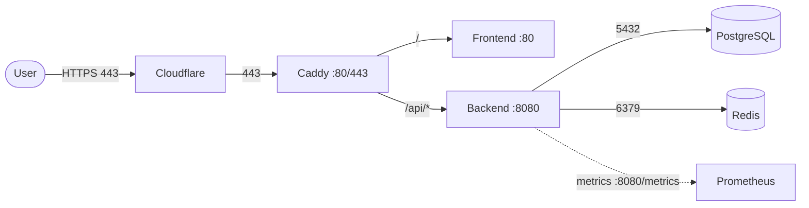

# Architecture — Networking

Everything runs on a single Docker bridge network. Services address each other by **service name**: DNS resolution is provided by Compose, so the backend connects to `postgres:5432`, not an IP. This page is the prose companion to [`architecture/diagrams/request-flow.mmd`](../../architecture/diagrams/request-flow.mmd).

## The one network

| Property | Value |
| --- | --- |
| Name | `infra-lab-net` |
| Driver | `bridge` |
| Subnet | `172.28.0.0/16` |
| Compose project | `infra-lab` |

A single network is deliberate for a single-host reference: it keeps the topology readable and means every service can reach every other service without a routing decision. The triggers to move to multiple networks (a separate management network, an egress-only network) are noted in the ADRs — they appear when isolation, not addressability, becomes the requirement.

## Host-exposed vs internal ports

Most ports are **internal only**. A small set is published to the host for dev convenience, and the production overlay removes the dangerous ones.

| Service | Internal port | Published to host (dev) | Published (prod) |
| --- | --- | --- | --- |
| `proxy` (Caddy) | 80, 443, 2019 (admin) | 80, 443 | 80, 443 (admin stays internal) |
| `frontend` | 80 | — | — |
| `backend` | 8080 | — | — |
| `postgres` | 5432 | `${POSTGRES_PORT:-5432}:5432` | **not published** |
| `redis` | 6379 | **not published** | **not published** |
| `prometheus` | 9090 | 9090 | not published |
| `grafana` | 3000 | 3000 | not published (route via VPN/internal) |
| `alertmanager` | 9093 | 9093 | not published |

Two principles:

- **Datastores stay internal by default.** Only Postgres is published in dev, purely so a local DB client can connect. The production overlay removes *all* datastore host ports — the only way to talk to Postgres or Redis in prod is from inside `infra-lab-net`.
- **Observability is internal-only in prod.** Grafana, Prometheus, and Alertmanager are reached on the dev host for convenience; in prod the overlay drops those host ports and you reach them via a VPN or an internal-only route.

## Egress

The host's egress is the only egress. Concretely:

- **Caddy** reaches the internet on 80/443 to obtain ACME certificates (when `PUBLIC_DOMAIN` is a real hostname) and to proxy outbound responses.
- **Image pull** — dev builds from source (no pull in the hot path); prod pulls `${REGISTRY}/infra-lab-*:${IMAGE_TAG}`.
- **No outbound from datastores.** Postgres and Redis have no network egress except the responses to their clients; they are not permitted to initiate traffic.

If you adopt an **egress allowlist** (a common production hardening step), it applies at the host/firewall layer, not inside compose — there is no per-service egress policy in Compose. That is one of the documented limits and a trigger to move to a network policy-capable platform.

## Putting the network through the request path

## See also

- [service-communication.md](service-communication.md) — what travels on these connections
- [environment-variables.md](environment-variables.md) — the host/peer values that wire it up
- [security/network-security.md](../security/network-security.md) — why ports are closed
- [ADR-0001](../adr/0001-use-docker-compose.md) — single-network, single-host trade-off
