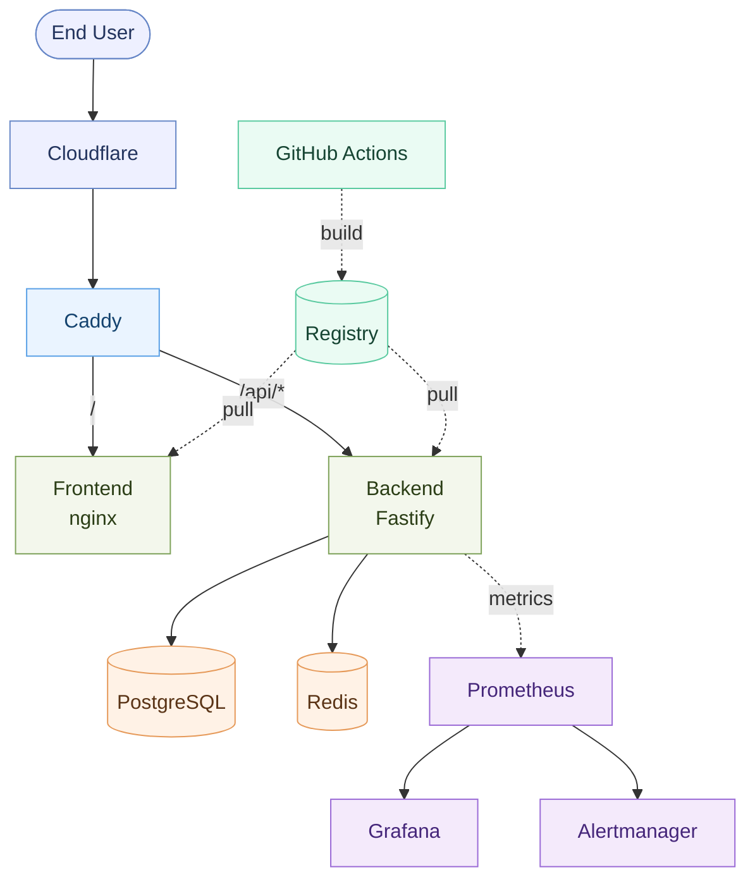

# Architecture — Overview

A single-host SaaS reference, expressed as Docker Compose overlays. The system has four planes — **edge**, **application**, **data**, and **observability** — plus a **delivery** pipeline. This page is the prose companion to [`architecture/diagrams/system-overview.mmd`](../../architecture/diagrams/system-overview.mmd).

*(Full, styled version: [system-overview.mmd](../../architecture/diagrams/system-overview.mmd).)*

## The planes

| Plane | Components | Responsibility |
| --- | --- | --- |
| **Edge** | Cloudflare, Caddy | TLS termination, routing, header policy, WAF/CDN |
| **Application** | Frontend (nginx), Backend (Fastify) | serve static assets; stateless API with health + graceful shutdown |
| **Data** | PostgreSQL, Redis | primary store (durable), cache + sessions (ephemeral) |
| **Observability** | Prometheus, Grafana, Alertmanager, exporters | scrape → record → alert → render |
| **Delivery** | GitHub Actions → registry | lint, test, build, scan, release immutable images |

## Shape of the system

- **Stateless edges, stateful core.** Frontend and backend carry no process-local state, so they can be restarted and grown; Postgres and Redis are the only stateful services, behind persistent volumes. The split is the foundation of the [scaling model](../scaling/overview.md).
- **One network, internal names.** All services live on `infra-lab-net` (`172.28.0.0/16`) and address each other by service name — the backend reaches `postgres:5432`, not an IP. See [networking.md](networking.md).
- **Health is the contract.** Every service exposes a healthcheck; the backend distinguishes liveness `/healthz` from readiness `/readyz`. Bring-up and rollback are gated on the latter. See [health-checks.md](../operations/health-checks.md).
- **Observability is declared.** Dashboards, rules, and scrape configs are files in `monitoring/`, not manual imports. See [monitoring.md](../operations/monitoring.md).
- **Images are immutable.** Dev builds from source; prod pulls a pinned tag from `${REGISTRY}`. The host runs an artifact, not a build. See [container-strategy.md](container-strategy.md).

## Where each concern lives

| Concern | Place |
| --- | --- |
| Diagrams (source of truth) | [`architecture/diagrams/`](../../architecture/diagrams/) |
| Runbooks & operations | [`docs/operations/`](../operations/) |
| Security posture | [`docs/security/`](../security/) |
| Decisions (the *why*) | [`docs/adr/`](../adr/) |

## See also

- [networking.md](networking.md) — the network in detail
- [service-communication.md](service-communication.md) — the inter-service contract
- [container-strategy.md](container-strategy.md) — image design
- [operations/deployment.md](../operations/deployment.md) — how the planes come up
