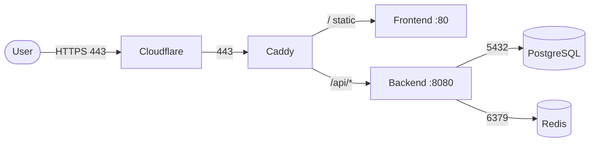

# Architecture — Service Communication

How a request flows between the planes, and the contract each hop depends on. The names and ports here match [`compose/docker-compose.yml`](../../compose/docker-compose.yml) exactly.

## The path

1. **User → Cloudflare.** TLS terminates at the edge; the WAF and CDN cache static assets. The origin receives a TLS connection from Cloudflare.
2. **Cloudflare → Caddy.** Caddy holds the origin certificate (automatic ACME when `PUBLIC_DOMAIN` is a real hostname). It routes by path.
3. **Caddy → Frontend** for `/` and static assets; **Caddy → Backend** for `/api/*`. Routing is declared in [`compose/Caddyfile`](../../compose/Caddyfile).
4. **Backend → PostgreSQL** for durable reads/writes (internal `postgres:5432`).
5. **Backend → Redis** for cache reads and session state (internal `redis:6379`).

## The contract between hops

| Hop | Protocol | Failure mode observed by caller | Caller's response |
| --- | --- | --- | --- |
| Edge → Caddy | HTTPS | connection refused / TLS error | Cloudflare serves a cached/edge error page |
| Caddy → frontend | HTTP :80 | connection refused | 502 Bad Gateway to the user |
| Caddy → backend | HTTP :8080 | connection refused, 5xx, or timeout | 502/504 Bad Gateway / Gateway Timeout |
| Backend → Postgres | TCP :5432 | query error / timeout | degrade: skip that feature, return 5xx if required |
| Backend → Redis | TCP :6379 | auth/timeout | **fall back to Postgres** (cache miss) — never fail the request on a cache error |

The cache row is the important one: **Redis is a cache, not a dependency the request depends on for correctness.** The backend treats the cache as a best-effort acceleration; if it is unavailable, the request still succeeds by reading from Postgres. This is why `RedisDown` is a `warning` while `PostgresDown` is `critical` (see [`monitoring/rules/alerts.yml`](../../monitoring/rules/alerts.yml)).

## Liveness vs readiness on the wire

The backend exposes two endpoints reached by Caddy (via the proxy overlay) and by the orchestrator's healthcheck:

- **`GET /healthz`** — the process answered. Used for *liveness*: if down, restart the container.
- **`GET /readyz`** — the process answered **and** its dependencies are reachable (pings Postgres + Redis). Used for *readiness*: if down, stop sending traffic — but do **not** restart.

Conflating them causes cascade restarts; splitting them correctly is what makes a rolling update drop-less. See [operations/health-checks.md](../operations/health-checks.md).

## Observability is a side plane

Scrape traffic is **out of the request path**. Prometheus pulls `/metrics` from each target on an interval; the frontend never blocks the user on a scrape, and a scrape failure does not affect serving. See [architecture/diagrams/observability-flow.mmd](../../architecture/diagrams/observability-flow.mmd).

## See also

- [networking.md](networking.md) — the addresses these hops use
- [operations/health-checks.md](../operations/health-checks.md) — liveness vs readiness
- [scaling/caching.md](../scaling/caching.md) — the cache-aside contract
- `compose/Caddyfile` — the routing rules
