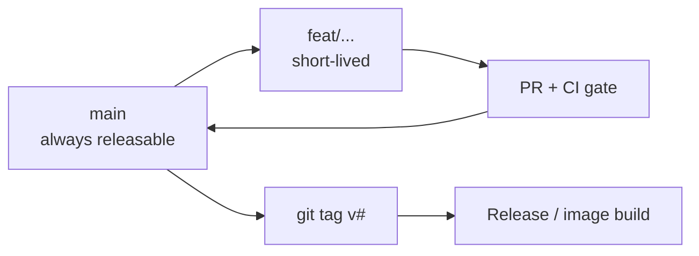

# Development — Branch Strategy

**Trunk-based** with short-lived branches. Long-lived branches are not used; they accumulate merge conflicts, drift from main, and increase the cost of every integration.

## The shape

- **`main` is always releasable.** CI must be green; the stack must boot. Never land a change that leaves `main` broken — the cost is borne by everyone.
- **Branches are short-lived.** `feat/...`, `fix/...`, `docs/...`, `chore/...`, merged within hours-to-a-couple-days. A branch a week old is a smell.
- **Conventional Commits** prefixes (`feat:`, `fix:`, `docs:`, `chore:`, `refactor:`, `test:`) make intent scannable in `git log`.
- **One change per PR.** Unrelated edits go in separate PRs so review and revert are scoped.

## The integration contract

A PR merges to `main` only when:

- `make lint` passes (shellcheck + `compose config` for all overlays),
- `make test` passes (backend suite),
- the stack boots (`make up && make ps` shows all `(healthy)`) — or the change demonstrably doesn't affect the stack,
- the README file tree and cross-links still match reality,
- a change to a setting updates `.env.example` **and** [`docs/architecture/environment-variables.md`](../architecture/environment-variables.md),
- a change to a decision updates or adds an ADR.

CI ([`.github/workflows/ci.yml`](../../.github/workflows/ci.yml)) enforces the mechanical parts before merge.

## Releases cut from `main`

A release is a **tag on `main`**: `git tag v0.2.0 && git push --tags`. The release workflow builds and publishes images and opens a GitHub Release — see [release-strategy.md](release-strategy.md). There is no release branch until the release cadence demands one.

## When you might diverge

- A **long-running feature** (a multi-week architectural change) that can't land in one PR: keep it on a `feat/...` branch and rebase onto `main` daily — conflicts stay small.
- A **hotfix**: branch off the tag you're patching, open the PR against `main` (this reference cuts new releases from `main`, not from a release branch), and cherry-pick onto anything else you need to patch. Not wired here; it isn't worth the ceremony at this scale.

## See also

- [release-strategy.md](release-strategy.md) — branches → tags → images
- [local-development.md](local-development.md) — what you branch from
- [`CONTRIBUTING.md`](../../CONTRIBUTING.md) — the PR checklist
- [ADR-0007](../adr/0007-cicd-strategy.md) — why GitHub Actions
