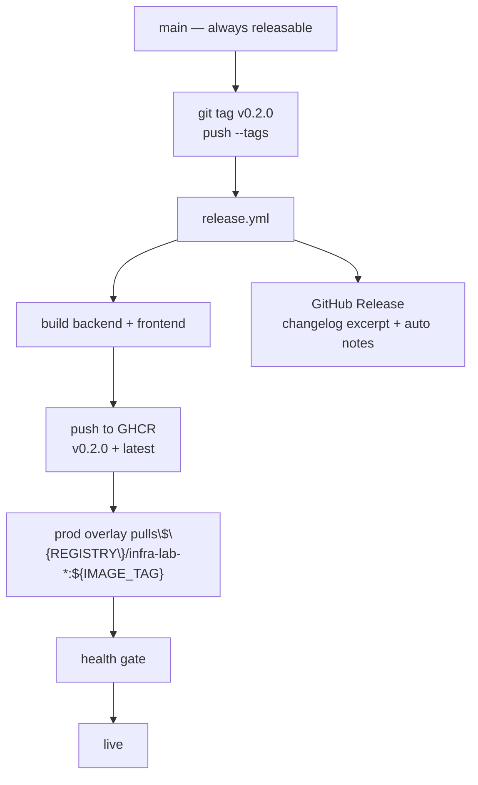

# Development — Release Strategy

A release is a **git tag on `main`**. The tag becomes an image tag the production overlay pulls. Everything else is automation. See [ADR-0007](../adr/0007-cicd-strategy.md).

## The pipeline



## Versioning

**Semantic Versioning** (`MAJOR.MINOR.PATCH`):

- `PATCH` — backwards-compatible fixes; no contract change.
- `MINOR` — backwards-compatible additions (a new endpoint, a new env var with a sensible default).
- `MAJOR` — a contract change (a renamed env var, a removed endpoint, a changed port) — adopters must change.

Pre-release tags (`v0.2.0-rc.1`) publish as **prerelease** GitHub Releases and are not promoted to `:latest`.

## The CHANGELOG

[`CHANGELOG.md`](../../CHANGELOG.md) follows [Keep a Changelog](https://keepachangelog.com). Edits go under **`[Unreleased]`** as work merges; on tag, a maintainer renames that section to the version with a date and opens a new `[Unreleased]`. The release workflow's notes step extracts the matching section for the GitHub Release body.

## Promoting to prod

A release is published — the image is in the registry, the tag exists. To run it in prod, the operator sets `IMAGE_TAG` in the prod `.env` (or passes it) and re-runs deployment:

```bash
# operator side, on the prod host
sed -i 's|^IMAGE_TAG=.*|IMAGE_TAG=v0.2.0|' .env
make prod-up        # pull the pinned image, apply hardening, scale
make health         # ALL CRITICAL PASS == deployed
```

There is no automatic prod-on-tag in this reference: **deployment to prod is an operator step, gated by a health check.** A future version may add an environment-aware deploy gate; the structure (pinned tag, health gate, rollback = revert tag) supports it without rework. See [operations/deployment.md](../operations/deployment.md).

## Rollback

"Rollback" is "set `IMAGE_TAG` back to the previous tag and re-run deployment":

```bash
sed -i 's|^IMAGE_TAG=.*|IMAGE_TAG=v0.1.9|' .env
make prod-up
make health
```

Because images are immutable and pinned, rollback is a pin revert — no source rebuild, no guesswork. The previous image still exists in the registry; you point at it.

## Limits (named)

- No staged (`canary`) rollout: prod-up replaces all replicas. Canary delivery is the rung above Compose.
- No automatic rollback on a failed health gate: the gate *halts*, and the operator decides.
- No image-signing / provenance: a future SLSA step on the release workflow is the natural extension.

## See also

- [deployment.md](../operations/deployment.md) — the operator side of a release
- [branch-strategy.md](branch-strategy.md) — what becomes a release
- [ADR-0007](../adr/0007-cicd-strategy.md) — CI/CD
- [`CHANGELOG.md`](../../CHANGELOG.md) — the log
- [`.github/workflows/release.yml`](../../.github/workflows/release.yml) — the automation
