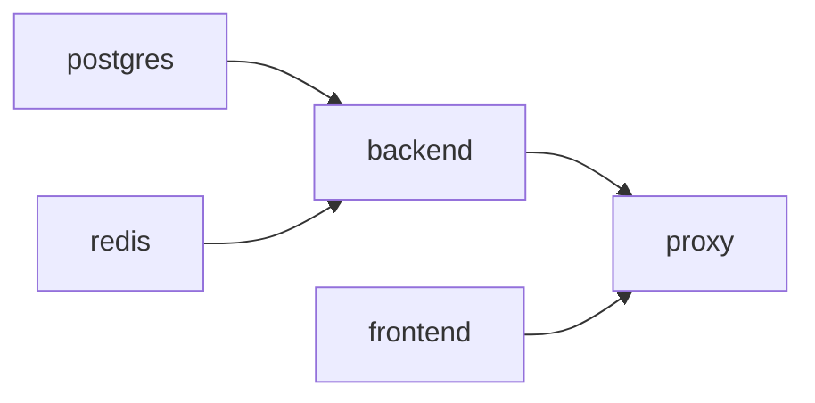

# Operations — Deployment

How the stack comes up, rolls out, drains, and rolls back. The guiding rule: **a deploy swaps an artifact, it does not mutate a running system.** See [ADR-0007](../adr/0007-cicd-strategy.md).

## Bring-up

```bash
cp .env.example .env
make bootstrap        # secrets + preflight
make up               # build + start (dev base + override)
make ps               # expect all (healthy)
make health           # mark health -> pass
```

Order of start-up is enforced by `depends_on` with health conditions:



The proxy is **not** started until both frontend and backend are healthy, so Caddy never receives traffic it cannot route. The backend is not started until Postgres and Redis are healthy, so `/readyz` can return 200 immediately.

## Rolling out a change

For a backend code change in dev:

```bash
make restart          # docker compose restart backend (graceful SIGTERM, then start)
make logs             # confirm startup, /readyz -> 200
```

`SIGTERM` triggers the backend's graceful shutdown (trap → drain in-flight → close pools → exit). The new container starts, passes its healthcheck, and the proxy resumes routing. With a single replica this is a stop-the-world restart; the production overlay's `deploy.replicas` makes it a rolling update.

## Production deployment

```bash
make prod-up          # pulls ${REGISTRY}/infra-lab-*:${IMAGE_TAG}, applies hardening, scales backend
```

The production overlay ([`compose/docker-compose.prod.yml`](../../compose/docker-compose.prod.yml)):

- **pulls** pinned images (no build) — run without `--build`
- **hardens** containers (read-only, cap drop, non-root, resource limits, no-new-privileges)
- **closes** datastore host ports and observability host ports
- **scales** the backend via `deploy.replicas` (honored with `--compatibility`, which `make prod-up` includes)

The image that CI built and scanned (see [`docker.yml`](../../.github/workflows/docker.yml), [`security.yml`](../../.github/workflows/security.yml)) and that release published (see [`release.yml`](../../.github/workflows/release.yml)) is the artifact pulled here — there is no second build between CI and prod.

## Drain & rollback

- **Drain a replica**: stop sending it traffic. In Compose there is no native drain, so the proxy-side health (`/readyz` → 503) is the mechanism: stop the backend and the proxy marks it unhealthy; in-flight requests drain within `SHUTDOWN_TIMEOUT_MS` before exit.
- **Rollback** to a prior version: set `IMAGE_TAG` to the previous tag and re-run `make prod-up`. Because images are immutable and pinned, "rollback" is "revert the tag and pull" — no source rebuild, no guesswork.

## The health gate

Bring-up and rollback both terminate at a health gate, not at "the containers started":

```bash
make health           # probes /healthz, /readyz, /api/status, and the observability endpoints
```

A deployment is successful only when `make health` reports `ALL CRITICAL PASS`. A container that is `Up` but whose `/readyz` returns 503 is **not** ready to serve and the deploy is not complete. See [health-checks.md](health-checks.md).

## See also

- [backup-restore.md](backup-restore.md) — what surrounds a deploy that touches data
- [health-checks.md](health-checks.md) — the gate in detail
- [development/release-strategy.md](../development/release-strategy.md) — how a tag becomes an image tag
- [ADR-0007](../adr/0007-cicd-strategy.md) — immutability
