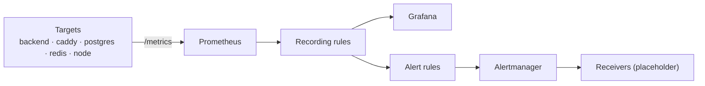

# Operations — Monitoring

Metrics pipeline: exporters expose `/metrics`, Prometheus scrapes and records, Grafana renders, Alertmanager routes. This page is the prose companion to [`monitoring/`](../../monitoring/) and [`architecture/diagrams/observability-flow.mmd`](../../architecture/diagrams/observability-flow.mmd). See [ADR-0006](../adr/0006-monitoring-stack.md).

## The model: pull, record, alert

- **Pull.** Prometheus reaches each target on an interval (15s here, literal in [`prometheus.yml`](../../monitoring/prometheus.yml)). Services don't know where to ship; the system knows what to scrape. This keeps the dependency graph one-directional: targets do not depend on Prometheus being up.
- **Record.** Recording rules pre-compute SLO indicators the dashboard and alerts both read (e.g. `job:backend_requests:rate5m`). There is one place to change the formula, and every consumer reads the same cheap series.
- **Alert.** Alerting rules are thresholds **on the recorded indicators** with `for` durations to ride out flapping. The unit of an alert is "this SLO indicator crossed a threshold for long enough to act on," not "this raw query looks alarming."

## What is observed

| Target | Metric origin | What it tells you |
| --- | --- | --- |
| `backend` | `/metrics` (Fastify) | request count, uptime, build commit |
| `proxy` | Caddy admin API (`:2019/metrics`) | connection/request counts, TLS state |
| `postgres-exporter` | exporter | connections, transaction rate, DB size |
| `redis-exporter` | exporter | cache hit rate, memory, connected clients |
| `node-exporter` | host | CPU, memory, disk — the host the whole stack lives on |

## Alerts that matter

Defined in [`monitoring/rules/alerts.yml`](../../monitoring/rules/alerts.yml):

| Alert | Severity | Meaning |
| --- | --- | --- |
| `Watchdog` | info | always-firing sentinel — proves the *pipeline* works |
| `BackendDown` / `ProxyDown` | critical | the serving path is broken |
| `PostgresDown` | critical | the durable store is unreachable |
| `RedisDown` | warning | cache is down — the app degrades gracefully, doesn't fail |
| `HighHostMemory` | warning | host pressure — the whole fleet is on one machine |
| `DiskAlmostFull` | critical | pgdata / volume at risk of exhaustion |

The `Watchdog` rule is the **whole pipeline's unit test**: if it stops firing somewhere it should, alerting is broken — and a quietly broken alerting system is worse than none, because you stop looking. See [architecture/diagrams/observability-flow.mmd](../../architecture/diagrams/observability-flow.mmd).

## Alert routing

[`monitoring/alertmanager/alertmanager.yml`](../../monitoring/alertmanager/alertmanager.yml) routes by `severity`: critical → `web-ops`, warning → `oncall`, info → `dead-letter`. Grouping by `[alertname, group]` keeps one ticket per outage; an **inhibit rule** suppresses lower-severity alerts in the same group while a higher one fires, so a proxy outage doesn't fan into a ticket per dependent exporter.

> Receivers are **placeholders** (`http://127.0.0.1:5001/alert`). Wire real Slack/email/PagerDuty before relying on this.

## Dashboards are versioned

Grafana's provisioning ([`monitoring/grafana/provisioning/`](../../monitoring/grafana/provisioning/)) loads the datasource (Prometheus, uid `prometheus`) and the dashboard provider on startup. The reference dashboard ([`overview.json`](../../monitoring/grafana/dashboards/overview.json)) renders service up status, backend uptime, request rate, and host memory/disk gauges — all from the recording rules, so they are cheap.

Dashboards live in the repository and are reviewed like code. There is **no manual import**: a panel that drifts from the system it graphs is a silent lie, and versioning prevents it.

## SLO thinking (not enforced here)

The reference records indicators; it does not yet encode SLOs (error budget, burn rate). The natural next step is to add a `slo:` set of recording rules (e.g. `http_requests:burn_rate5m`, `:error_budget_remaining`) and alert on burn rate rather than raw error counts. This is left as the obvious extension; the structure supports it without rework.

## See also

- [`monitoring/README.md`](../../monitoring/README.md) — the config inventory
- [health-checks.md](health-checks.md) — liveness vs readiness
- [ADR-0006](../adr/0006-monitoring-stack.md) — why Prometheus + Grafana
