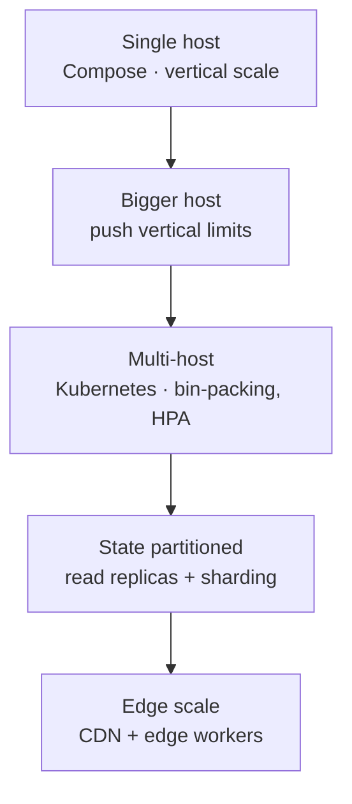

# Scaling — Overview

How the system grows, and where Docker Compose stops being the right answer. The honest framing: scaling on a single host is mostly **vertical**, with bounded horizontal scaling of the stateless services; the horizontal scaling that matters for real growth is the rung above Compose.

## The scaling model in one table

| Component | Scales... | On Compose, by... | Trigger to move off Compose |
| --- | --- | --- | --- |
| Frontend (nginx) | horizontally, free | `deploy.replicas: 2` (idempotent) | rarely a trigger — static |
| Backend (Fastify) | horizontally, stateless | `BACKEND_REPLICAS` | when traffic exceeds one host |
| PostgreSQL | **vertically** (CPU/RAM/disk) | resource limits | when a single host can't hold the DB |
| Redis | **vertically** (RAM) | resource limits | when cache size exceeds one host |
| Host | vertically (one machine) | bigger instance | when one machine can't hold the fleet |

## Why the split matters

The services and the stores scale on **different laws**:

- The **stateless** services (frontend, backend) scale horizontally almost "for free" — add replicas, add machines. Each replica is interchangeable because it holds no state. See [stateless-services.md](stateless-services.md).
- The **stateful** stores (Postgres, Redis) scale on the **hard axis**: Postgres first gets **bigger** (vertical), and only jumps to replicas/sharding when a single host can't cope — and write-scaling Postgres is genuinely hard. See [database.md](database.md).
- The **cache** (Redis) buys you read-headroom on the DB, so it postpones the database's vertical ceiling — but it is a trade, not a free win. See [caching.md](caching.md).

## What Compose actually gives you

`deploy.replicas` under Compose (with `--compatibility`, which `make prod-up` includes) starts N copies of a service on the same host. That is **horizontal scaling on one host** — bounded by the host's CPU/RAM. Compose does not:

- **bin-pack** across hosts (no scheduler),
- **autoscale** by metrics (no horizontal pod autoscaler),
- **load-balance** replicas except by DNS round-robin via the service name inside `infra-lab-net`.

For the proxy to spread load across backend replicas you'd want an explicit load balancer or `deploy.replicas`'s implicit DNS; Caddy's `reverse_proxy backend:8080` will round-robin across the A records compose gives it. That works; it is not "an orchestrated rollout with health-gated canaries."

## The growth ladder

Each step's trigger is the **previous step's exhausted limit**, named in the relevant ADR.

## See also

- [stateless-services.md](stateless-services.md)
- [database.md](database.md)
- [caching.md](caching.md)
- [ADR-0001](../adr/0001-use-docker-compose.md) — the Compose limit
- [ADR-0002](../adr/0002-use-postgresql.md) / [0003](../adr/0003-use-redis.md) — store choices
