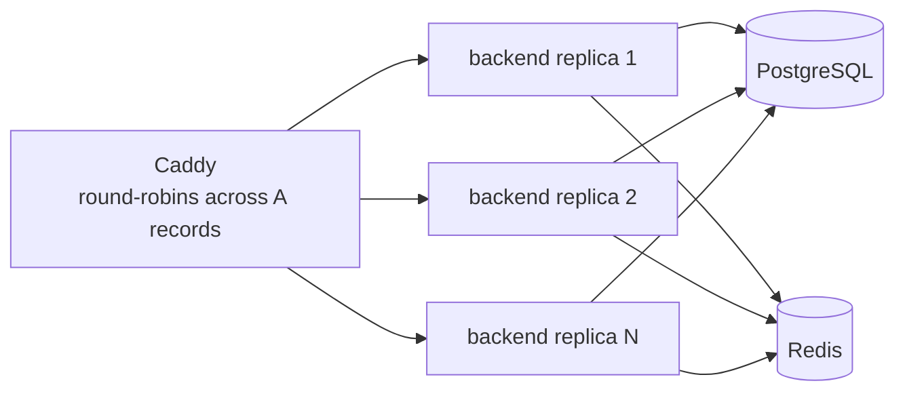

# Scaling — Stateless Services

The frontend and backend are **stateless**: a request to any replica yields the same answer, because the replica holds no process-local state. That single property is what makes them scale horizontally.

## What "stateless" buys you

- **Replicas are interchangeable.** Add or remove one and you do not need to migrate state; the only thing in the replica is the running process.
- **Rolling updates are free.** Stop one, start the new one, let the health gate pass; repeat. No drain window, no data handoff.
- **Restart = recovery.** A wedged process is restarted, and because it had nothing worth keeping, the restart is *the* recovery, not a loss.
- **Failure is correlated with the host, not the request.** A user who hit the dead replica is retried onto a live one at the proxy.

The result: the **horizontal axis is free for these services** — up to the host. Scaling them across hosts is a scheduler concern (the rung above), but on single-host Compose you already get `BACKEND_REPLICAS` copies for the cost of an env var.

## What "stateless" actually requires

The backend in this repo is the worked example:

- **No process-local sessions.** Sessions go to Redis, not to a backend process's memory. See [caching.md](caching.md).
- **Database connections via a pool.** Each replica opens its own pool to Postgres (`pg`'s `Pool`); the pool is local to the process, but the data it reads comes from Postgres, not from the replica. The total connection count is `replicas × pool_max` — and that is exactly the number you must let Postgres handle (see [database.md](database.md)).
- **Config from the environment.** The same image, same config inputs → same behavior. No replica-specific state worth preserving.

## The footguns you avoid by being stateless

- **Sticky sessions** ("always send user X to replica 2"). They break the horizontal axis: you can no longer drop a replica without losing continuity. This repo does not use them. The cost is that a session in Redis outlives the replica — which is the point.
- **In-process caches** ("a per-replica LRU on the hot rows"). Saves a network hop, but creates a **per-replica inconsistency**: replica A's cache may differ from replica B's. Acceptable for some hot, blob-like data; a footgun for correctness-sensitive data. Avoid until measured.
- **Singletons** ("the primary scheduler runs only in replica 1"). Replicas with role-specific logic are not interchangeable and break rolling updates. If you need a singleton, run it as a separate service with `replicas: 1`, not as a booby-trapped replica.

## Horizontal scaling in this stack

`deploy.replicas: ${BACKEND_REPLICAS}` in the prod overlay starts N backends; Caddy's `reverse_proxy backend:8080` resolves the service name to N A records and balances across them. No autoscaling — you set the count.

## See also

- [overview.md](overview.md) — the axis this sits on
- [database.md](database.md) — the connections those replicas cost Postgres
- [caching.md](caching.md) — where shared state lives instead
- [../operations/deployment.md](../operations/deployment.md) — drop-less rolling updates
